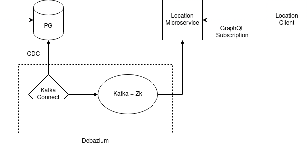

# CDC using Debazium (Outbox pattern implementation in microservices)

This is sample application that demonstrates
  - User updates/add incident data in postgres database (through another application/microservice/ or we dont know and we don't care...)
  - Kafka Connect detects the change and inform kafka about new data change
  - Kafka produce a new event to the relevent topic
  - Microservice listens the particular topic and get new event data
  - When it receives new data, it published data to a websocket (Graphql Subscription in this case)
  - Frontend/Client application receives data realtime

## Run in Prod

Just 

`docker-compose up -d`

Change host path in location-client -> .env.production if you are not using localhost

## Registering the connector (only for dev/manual)
curl -i -X POST -H "Accept:application/json" -H "Content-Type:application/json" http://localhost:8083/connectors/ --data @register-connector.json

curl -H "Accept:application/json" localhost:8083/connectors/

curl -i -X GET -H "Accept:application/json" localhost:8083/connectors/incident-location-connector

## List all topics
sudo docker-compose exec kafka /kafka/bin/kafka-topics.sh --list --bootstrap-server kafka:9092

## Listen to the topic
sudo docker-compose exec kafka /kafka/bin/kafka-console-consumer.sh --bootstrap-server kafka:9092 --from-beginning --property print.key=true --topic dbserver1.public.tbl_incident_locations